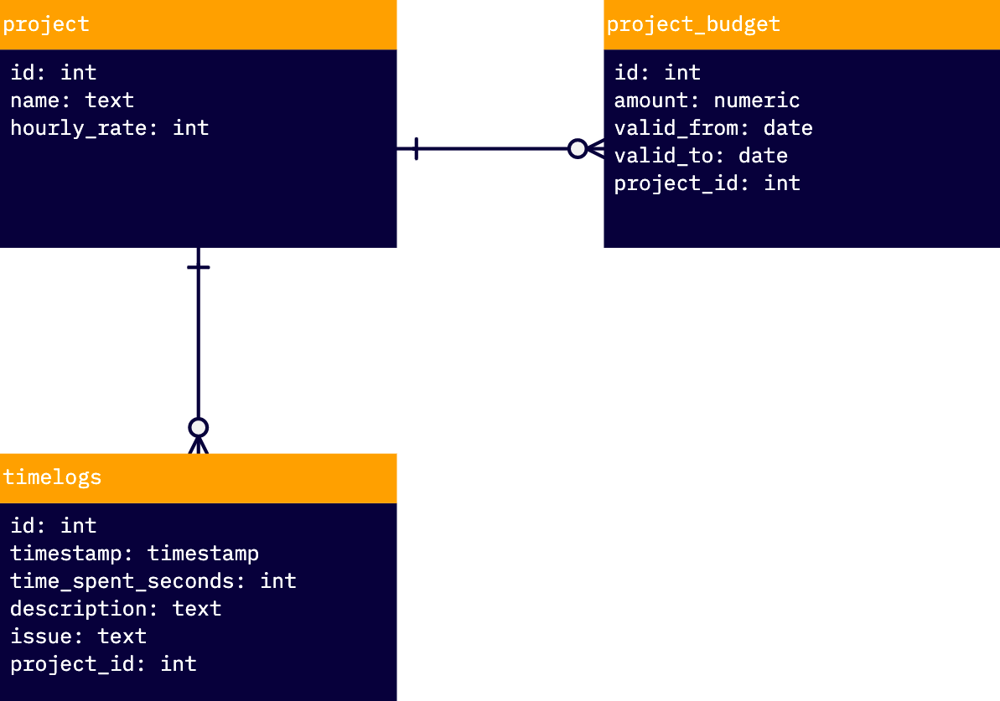

# Take Home Challenge

Dear applicant

The following content is your take-home-challange. It is the second step of the brudi recruiting process.
You will get evaluated based on your submitted solution. 

This challenge should not be solved like a code riddle where the easiest solution is the best. 
You should rather show what you can, so that we have something to evaluate.

**important note:**
It does not matter if you are not finished completely. It is hard to finish everything perfectly in the given time limit.
It is generally better to submit the project in a clean state with the parts that work and a good reflexion about it
rather than have it completed with bad code and a poor reflexion.

Please read the introduction carefully before starting the challenge.

Good luck!

## Introduction
1. Setup the project with either javascript/typescript or python
2. choose any framework you want or do it from scratch
3. use the given API
4. write at least 1 useful test
5. create a readme on how to setup, run and test your project
6. when you are finished, submit a pull request with your solution to the given github repository
7. inform via mail that you are finished - **the time limit stops here!**
8. write a retrospective.md about your challenge

**time limit: 4h - starts with getting this Information; ends with information email(point 7)**

After you are finished with the challenge, write a retrospective.md about your work with the following content
   1. Describe your architecture decisions(why did you choose to make it with ...)
   2. How was the challenge for you in terms of difficulty?
   3. Did you encounter any problems? How did you solve them?
   4. Do you see any improvements in your solution?

**The retrospective does not have to be in the time limit of 4h and can be delivered per mail afterwards**


## Challenge

**Context**

Project manager have multiple projects to manage sometimes.
Those projects can have multiple budgets with different time ranges and various persons logging their working time on it.
This can get very confusing with increasing number of projects.
To tackle this, we need a project budget dashboard which shows all important information on one page.


User Story 1 has priority.
Only start with User Story 2, if you finished Story 1 completely(keep in mind important note from introduction).

**User Stories**

```
User Story 1 - Project Budget Dashboard

As a project manager I want to
have a simple project budget dashboard(UI) where I can
    see all issues with accumulated time_spent in hours
    see the remaining project budget
    see the hourly_rate of the project
so that i'm always up to date with the project

Acceptance Test:
- issues are visible per month
- month can be switched (there is data for december 2022/january 2023)
```

```
User Story 2 - Create Timelog Entries

As a project manager I want to
create new timelog entries
so that i can log working time on issues

Acceptance Test:
- dashboard data are automatically updated after create without page refresh
```

## API

### Rest Endpoints

#### Auth

Add auth header to request and use the secret in sent to you with the email:
```
{ x-hasura-admin-secret: '{AUCH SECRET FOR API FROM EMAIL}' }
```

**getProjects**

https://brudi-take-home.hasura.app/api/rest/projects

```
{
    "project": [
        {
            "hourly_rate": 160,
            "id": 1,
            "name": "Basel"
        },
        {
            "hourly_rate": 140,
            "id": 2,
            "name": "Zürich"
        }
    ]
}
```

**getTimelogs**

https://brudi-take-home.hasura.app/api/rest/timelogs

```
{
    "timelogs": [
        {
            "description": "Arbeit an Basel",
            "id": 24,
            "issue": "BS-02",
            "project_id": 1,
            "time_spent_seconds": 1235,
            "timestamp": "2022-09-11T12:00:15+00:00"
        },
        ...
    ]
}    
```

**getBudgetByProjectId**

https://brudi-take-home.hasura.app/api/rest/project/:id/budget

```
{
    "project_budget": [
        {
            "amount": 30000,
            "id": 1,
            "project_id": 1,
            "valid_from": "2022-01-01",
            "valid_to": "2022-12-31"
        }
    ]
}
```

**getTimelogsByProjectId**

https://brudi-take-home.hasura.app/api/rest/project/:id/timelogs

```
{
  "timelogs": [
    {
      "description": "Arbeit an Basel",
      "id": 24,
      "issue": "BS-02",
      "project_id": 1,
      "time_spent_seconds": 1235,
      "timestamp": "2022-09-11T12:00:15+00:00"
    },
    ...
  ]
}
```

**createTimelog**

https://brudi-take-home.hasura.app/api/rest/timelog

Request body:
```
{
  'description': 'Arbeit in Zürich',
  'issue': 'ZH-15',
  'project_id': '2',
  'time_spent_seconds': '1600',
  'timestamp': '2022-09-11T12:00:15+00:00' 
}
```

Response:
```
{
    "insert_timelogs": {
        "returning": [
            {
                "description": "Arbeit in Zürich",
                "id": 54,
                "issue": "ZH-15",
                "project_id": 2,
                "time_spent_seconds": 1600,
                "timestamp": "2022-09-11T12:00:15+00:00"
            }
        ]
    }
}
```

### Database




